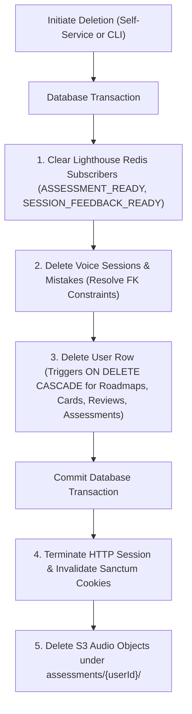

# Privacy, Data Retention, and Deletion Policy

This document outlines the privacy architecture, data collection practices, retention schedules, and account deletion mechanisms implemented in the AI Language Coach application (plan §5 "Privacy", §7 checklist).

---

## 1. What Data Is Collected

The application collects and processes only the data strictly necessary for language coaching, CEFR assessment, conversational practice, and spaced repetition:

| Data Category | Purpose | Storage Location | Schema Model / Table |
|---|---|---|---|
| **Account Information** | User identification, authentication, and CEFR level tracking | MySQL 8.4 | `users` (`name`, `email`, `password` hash, `target_language`, `timezone`, `current_level`) |
| **Voice Consent Timestamp** | Evidencing server-side consent for audio recording and speech processing | MySQL 8.4 | `users.voice_consent_at` |
| **Onboarding Audio Recordings** | Speech-to-text transcription and CEFR level assessment | S3 / MinIO (`assessments/{userId}/{ulid}.{ext}`) | `assessments.audio_url` |
| **Spoken Session Transcripts & Latency** | Pedagogical review, mistake detection, and turn performance telemetry | MySQL 8.4 | `voice_sessions.transcript` (JSON array of turns and telemetry) |
| **Grammar Mistakes & Feedback** | Tracking learner mistakes, providing corrections, and generating explanations | MySQL 8.4 | `mistakes` (`user_utterance`, `correction`, `explanation`, `grammar_point_id`) |
| **Spaced Repetition Schedule** | Scheduling flashcards and review intervals using the SM-2 algorithm | MySQL 8.4 | `review_items` (`ease_factor`, `interval_days`, `repetition_number`, `next_review_at`) |
| **Realtime Subscriptions** | Realtime broadcast delivery for assessment results and session feedback | Redis 7 | `graphql.topic.*` sets and `graphql.subscriber.*` entries |

---

## 2. Consent Recording & Evidencing

Consent for recording and processing audio is captured and stamped server-side:

- **Database Representation**: Stored in `users.voice_consent_at` as a nullable `TIMESTAMP`.
- **Immutability**: Stamped via `App\Privacy\VoiceConsent::record(User $user)`. If `users.voice_consent_at` is already populated, it is never overwritten or updated.
- **Single Place of Truth**:
  1. **Onboarding Assessment**: Stamped upon calling the `submitAssessment(audioUrl: String!)` GraphQL mutation when initial audio is submitted.
  2. **Conversational Practice**: Stamped upon calling the `requestVoiceToken(lessonCardId: ID!)` GraphQL mutation when a voice session is actually created.
- **Protection**: `voice_consent_at` is explicitly excluded from Eloquent mass-assignment (`#[Fillable]` on `User`), preventing clients from modifying or forging it via mutation inputs.
- **GraphQL Exposure**: Exposed as `User.voiceConsentAt` (`DateTime`) in `types/user.graphql` and viewable on the `/settings` page.

---

## 3. Data Retention Policy & Scheduled Purges

Data is retained only as long as pedagogically or operationally required:

| Data Category | Config Key | Environment Variable | Default Retention | Purge Mechanism | Behavior |
|---|---|---|---|---|---|
| **Assessment Audio** | N/A | N/A | Processing duration (< 5 min) | `AnalyzeAssessment` job | Deleted from S3 immediately upon successful transcription and assessment. |
| **Orphan Assessment Audio** | `privacy.orphan_audio_retention_days` | `PRIVACY_ORPHAN_AUDIO_RETENTION_DAYS` | 7 days | `privacy:purge-orphan-audio` (daily) | Safety net for recordings whose analysis job died or was abandoned before deletion. Purges S3 files older than the threshold that have no matching assessment row in `processing`. |
| **Session Transcripts** | `privacy.transcript_retention_days` | `PRIVACY_TRANSCRIPT_RETENTION_DAYS` | 90 days | `privacy:purge-transcripts` (daily) | Clears `voice_sessions.transcript` for sessions older than 90 days. Keeps the session row, duration, status, mistakes, and review items (the learner's pedagogical progress). |
| **Subscription Presence** | `lighthouse.subscriptions.storage_ttl` | `LIGHTHOUSE_SUBSCRIPTION_STORAGE_TTL` | 3600 seconds (1 hour) | Redis key TTL | Redis keys expire automatically to prevent unbounded subscriber accumulation. |

### Scheduled Purge Commands

Scheduled in `backend/routes/console.php` to run on a daily basis:
```bash
# 1. Clear session transcripts older than 90 days (keeps session records and mistakes)
php artisan privacy:purge-transcripts [--dry-run]

# 2. Delete orphan S3 recordings older than 7 days
php artisan privacy:purge-orphan-audio [--dry-run]
```
Both commands are idempotent, support `--dry-run` for auditing without data alteration, and print detailed execution summaries.

---

## 4. Account Deletion

Account deletion removes all personal data, learning progress, active subscriptions, and stored media files. Exactly one deletion service class (`App\Privacy\AccountDeletionService`) handles all deletions.

### Deletion Interfaces

1. **Self-Service Deletion**:
   Learners can delete their account on the `/settings` page via the `deleteAccount(password: String!, confirmation: String!)` GraphQL mutation (`@guard`).
   - The user must provide their current password. An incorrect password returns a typed client-safe error code `PASSWORD_MISMATCH`.
   - The user must provide the literal confirmation string `DELETE`. Any other value returns a typed client-safe error code `CONFIRMATION_REQUIRED`.
2. **Operator Deletion**:
   Operators can execute manual out-of-band deletion requests via Artisan CLI:
   ```bash
   php artisan privacy:delete-user user@example.com
   ```

### Deletion Execution Sequence

The deletion procedure follows a strict, safe ordering:



1. **Clear Subscription Subscribers**:
   Lighthouse subscription subscribers in Redis are cleared by topic (`ASSESSMENT_READY`, `SESSION_FEEDBACK_READY`) *before* the database row is deleted. This prevents `ModelNotFoundException` crashes on future broadcasts caused by stale subscriber models (README decision 19).
2. **Resolve FK Constraints & Delete User**:
   Inside a database transaction, dependent `mistakes` and `voice_sessions` rows are removed to avoid foreign key deadlocks on `voice_sessions.lesson_card_id -> lesson_cards.id`, followed by deleting the `users` row. Foreign keys configured with `ON DELETE CASCADE` automatically delete `roadmaps`, `lesson_cards`, `assessments`, and `review_items`.
3. **Session Invalidation**:
   The current web session is invalidated and CSRF tokens are regenerated (`$request->session()->invalidate()`).
4. **S3 Media Purge**:
   All objects stored under `assessments/{userId}/` are deleted from S3 via `S3Client::deleteMatchingObjects()`. Any S3 errors are logged and reported (e.g., to Sentry) rather than rolling back the completed account deletion or leaving an inconsistent state.

### S3 Deletion Failures and Residual Media Cleanup

When deleting assessment audio objects from S3 fails during account deletion (for instance, due to an S3 API outage or transient network error), `AccountDeletionService::deleteUserAudioObjects()` catches the exception and reports it (via Laravel's `report()` to Sentry / error tracking) rather than rolling back the completed database deletion.

Rolling back after the database transaction has committed would leave an inconsistent state or attempt to resurrect an account whose relational records were already cascaded and removed. Account deletion therefore completes immediately and permanently from the learner's perspective, while any un-deleted audio recordings temporarily remain in S3 under `assessments/{userId}/`.

Residual audio objects are subsequently swept and removed by the scheduled orphan audio purge:
- **Scheduler Registration**: Verified in the codebase — `backend/routes/console.php` explicitly schedules the purge command to run daily via `Schedule::command('privacy:purge-orphan-audio')->daily()`.
- **Retention Policy**: Controlled by `config('privacy.orphan_audio_retention_days')` (`PRIVACY_ORPHAN_AUDIO_RETENTION_DAYS`, default 7 days).
- **Purge Logic** (`App\Console\Commands\PurgeOrphanAudio`): Scans keys under `assessments/`, keeping objects newer than the cutoff date or whose assessment is actively in `AssessmentStatus::Processing`. For a deleted account, all assessment rows have already been deleted from MySQL, so any residual files are recognized as orphans once they exceed the 7-day retention cutoff and are deleted from S3 via `S3Client::deleteObject()`.
- **Auditing**: Supports `--dry-run` (`php artisan privacy:purge-orphan-audio --dry-run`) to preview candidates without modifying S3.

Operationally, the user's account deletion is final upon execution, while any residual S3 audio objects resulting from transient storage failures are guaranteed to be cleaned up within the configured 7-day retention window.

---

## 5. What Learners Should Expect Operationally

- **Immediate Access Revocation**: Upon confirmation, authentication sessions and tokens are immediately invalidated, and the user is redirected to `/login`.
- **Permanent Data Deletion**: User profile details, active and archived roadmaps, lesson history, audio transcripts, grammar mistakes, and spaced repetition schedules are permanently deleted from primary databases.
- **Shared Reference Data Preserved**: Canonical CEFR grammar points in `grammar_points` are shared pedagogical reference data and remain untouched.

---

## 6. Honest Limitations

- **No Self-Service Data Export Yet**: A self-service data export / takeout endpoint (e.g. JSON/CSV export) is not yet implemented. Learners requesting a copy of their personal data must contact operators for manual export.
- **Database Backups & Snapshots**: Operational database deletion takes effect immediately in the live MySQL database. However, existing automated database snapshots and point-in-time recovery logs (such as AWS RDS backup windows, configured between 7 and 35 days) retain deleted database records until individual backup snapshots age out according to the backup retention window. Deletion is instantaneous on live systems, but complete elimination from historical backups occurs after the backup expiration period.
